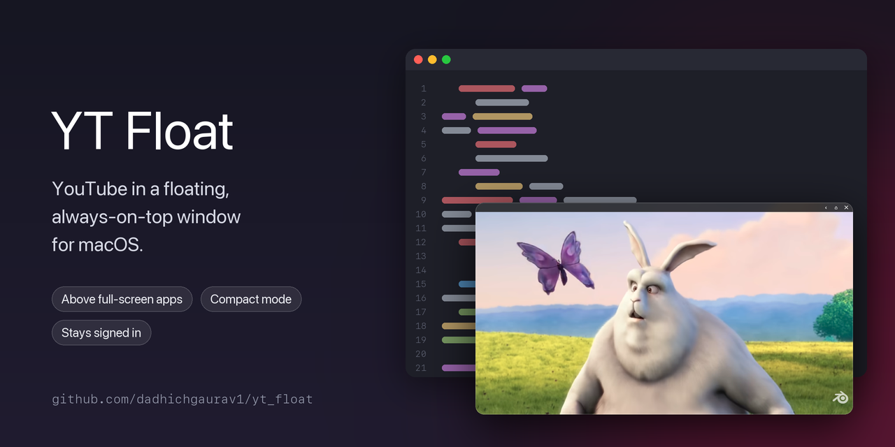

# YT Float



YouTube in a small, frameless, always-on-top window for macOS. It floats over everything (including full-screen apps and every Space), stays signed in to your own account, and gets out of the way when you're not touching it.

Built with Electron and plain JavaScript. There's no frontend framework, no tracking and no updater.

## Features

- **Floats everywhere:** always on top, including above full-screen apps, and visible on all Spaces.
- **Stays out of the way:** frameless window with rounded corners and a subtle shadow. A thin drag bar with **Back / Home / Close** appears only when you hover the top edge. Everything else stays clickable, so YouTube's own controls work normally.
- **Sized for video:** resizable from any edge or corner, minimum 320×180, locked to 16:9 by default (toggleable).
- **Remembers itself:** last position and size are restored on launch.
- **Compact mode:** hides YouTube's header and sidebar. On a video page, the player fills the window.
- **Adjustable opacity:** from 40% to 100%.
- **Menu bar app:** tray icon with all the controls. The Dock icon is hidden by default (optional).
- **Stays signed in:** persistent session, so you sign in once.

## Screenshots

| Normal | Compact mode (⌥⌘C) with the hover drag bar |
|---|---|
|  |  |

<sub>Video: *Big Buck Bunny* © Blender Foundation, CC BY 3.0.</sub>

## Keyboard shortcuts

| Shortcut | Action |
|---|---|
| ⌥⌘Y | Show / hide the window (works from any app) |
| ⌥⌘T | Toggle always-on-top |
| ⌥⌘↑ / ⌥⌘↓ | Opacity up / down |
| ⌥⌘C | Toggle compact mode |
| ⌘[ | Back |
| ⇧⌘H | YouTube home |

Only ⌥⌘Y is global. The rest work while YT Float is the active app.

## Menu bar icon

Show/Hide · Compact Mode · Always on Top · Lock 16:9 Aspect Ratio · Show Dock Icon · Reset Window Position · Sign in with Google (separate window) · Quit

Close (in the drag bar) hides the window to the menu bar. Use **Quit** to exit.

## Download

Grab `YT-Float-<version>-mac-universal.zip` from the [latest release](https://github.com/dadhichgaurav1/yt_float/releases/latest). It runs on Apple Silicon and Intel Macs.

1. Unzip it and move `YT Float.app` into Applications.
2. Open it. macOS blocks the first launch, because the app is not notarized by Apple.
3. Go to **System Settings → Privacy & Security**, scroll down, and click **Open Anyway** next to the YT Float message. You only need to do this once.

If you prefer the terminal, this does the same thing:

```bash
xattr -dr com.apple.quarantine "/Applications/YT Float.app"
```

## Build from source

Requires macOS and Node.js 18+.

```bash
git clone https://github.com/dadhichgaurav1/yt_float.git
cd yt_float
npm install
```

Run in development:

```bash
npm start
```

Or create a double-clickable dev launcher, `~/Applications/YT Float (Dev).app`. It shows up in Spotlight and can be kept in the Dock. Each click quits any running YT Float and starts this checkout's source, logging to `/tmp/yt-float-dev.log`:

```bash
npm run make-launcher
```

Build a standalone app:

```bash
npm run build
```

This produces `dist/mac-<arch>/YT Float.app` for your Mac's architecture (`npm run build:universal` builds one that runs on both). The build is ad-hoc signed, so no Apple Developer account is needed, and Apple Silicon Macs won't report it as "damaged". Copy it into Applications:

```bash
ditto --noextattr "dist/mac-arm64/YT Float.app" "/Applications/YT Float.app"
```

If macOS warns on first launch, right-click the app and choose **Open**, once.

> If the project lives in an iCloud-synced folder (like `~/Documents`), a Finder drag can carry over file attributes that break the signature. Use the `ditto --noextattr` command above, or run `xattr -cr "/Applications/YT Float.app"` afterwards.

## Signing in to Google

Google blocks sign-in from many embedded browsers ("This browser or app may not be secure"). To work around this, YT Float never signs you in inside the floating window. Clicking **Sign in** on YouTube (or using the menu bar item) opens a separate, normal window that presents itself as Firefox. It shares the same session with the floating window. Once Google sends you back to YouTube, that window closes and the floating window reloads signed in.

Google may change its checks at any time, so this can break without warning.

## How it works

| File | Purpose |
|---|---|
| `src/main.js` | Main process: window, shortcuts, tray, cursor polling for the drag bar, sign-in window |
| `src/preload.js` | Injected into YouTube: creates the drag bar and toggles compact mode |
| `src/inject.css` | Drag bar and compact-mode styles |
| `src/signin-preload.js` | Makes the sign-in window look consistently like Firefox |
| `src/store.js` | Tiny JSON settings store |
| `build/adhoc-sign.js` | Post-package hook that ad-hoc signs the `.app` |

Settings and the login session live in `~/Library/Application Support/YT Float/`. Delete that folder to reset everything.

The drag bar is shown by polling the cursor position from the main process. Frameless windows don't reliably deliver hover events over drag regions, so the page can't detect the hover on its own.

## Limitations

- macOS only.
- Compact mode relies on YouTube's current page structure and may need updating when YouTube changes its layout.
- Out of scope: ad blocking, downloading videos, multiple windows, Windows/Linux builds, auto-updates.

## Disclaimer

Not affiliated with, endorsed by, or sponsored by YouTube or Google. YouTube is a trademark of Google LLC. This is a personal wrapper around the regular youtube.com website. Use it in line with YouTube's Terms of Service.

## License

Public domain, under the [Unlicense](LICENSE). Do whatever you want with it.
